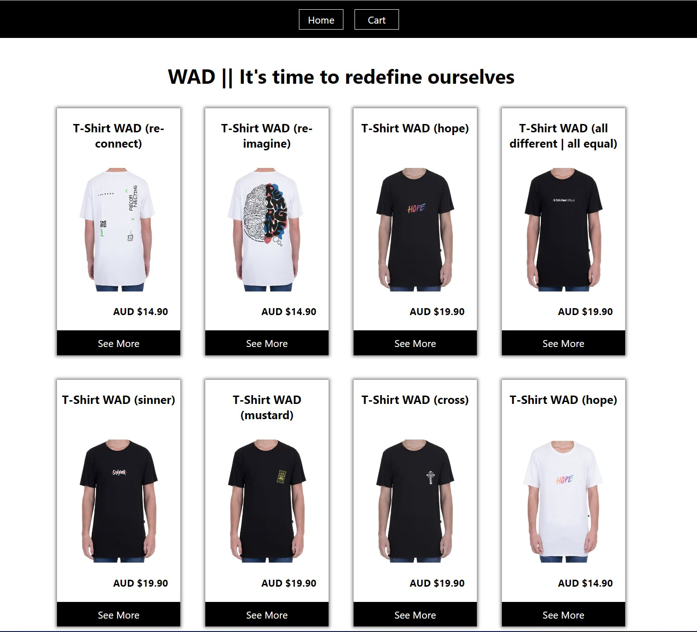
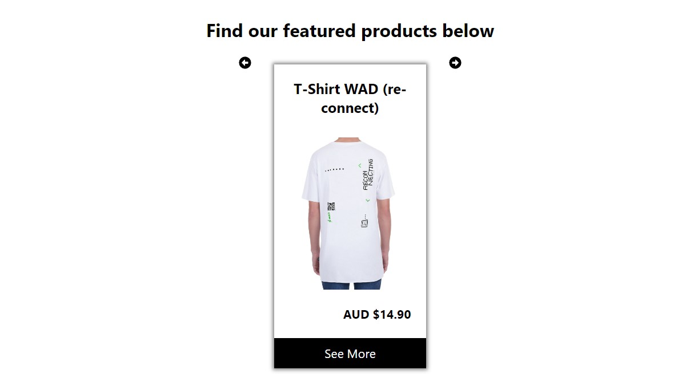
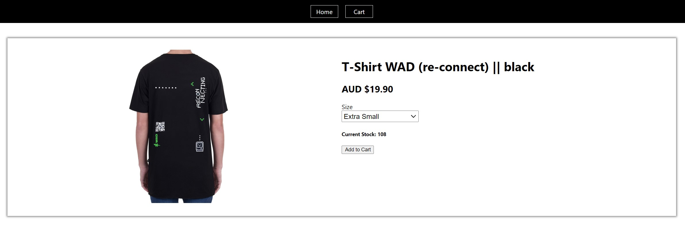

# React e-Shop

## Outline

This project is designed to reinforce your React learnings and make sure that you are comfortable with most aspect of the framework.
With this project you will practice how to:

-   Fetch Data within a React App
-   Use react-router-dom
-   Use Firebase/Firestore

## MVP

At a minimum your e-shop website should have two pages:

-   Home Page
    -   This will contain:
        -   A Grid of products
        -   Carousel of featured products
        -   Product Page (with id parameter) Similar to a product page on another site, allows you to add to cart and select product variants (When added to cart, stock should be updated in my Firestore DB)
-   All products should be stored in Firestore:
    -   You should store the following information:
        -   quantity
        -   variants (could be colors, sizes, etc)
        -   price per unit
        -   name
        -   image url
        -   featured or not (boolean)
        -   All data should be stored in Firestore and fetched by the frontend, there should be NO static product data in the react application

## Approach

I started this project by defining a layout and the structure on a piece of paper. Having done that helped me see which containers and components I needed for this project:

-   Containers:
    -   ProductList
    -   FeaturedProductList
    -   ProductPage
-   Components:
    -   Nav
    -   ProductCard

I designed the basic components with static data first, to test them.

Once I was satisfied with its rendering, I planned and created the Firestore Database with 2 records only, so I could test that the connection to it for CURD was working properly.

Once I confirmed the connection was working fine, I created the rest of the products' records in the DB.

I added a little bit of Styling and created the conditional rendering.

Finally, I ensured the Add to Cart button updates the stock in my DB and reflects it in the Product Page.

## Known Issues

-   I couldn's use useContext satisfactory, so I realised that I have several calls to the DataBase when I render different containers. This is not desired and it should be fixed by using useContext, or even localStorage/sessionStorage.
-   Cart Page is black at the moment. I wanted to ensure that the MVP was fully done before jumping into the Bonus, but I didn't have enough time for additional functionalities.

## Things I'd do differently next time

-   I'd spend some more time researching useContext and other useful Hooks before jumping into the project. Because refactoring is not that easy or intuitive yet. This way, I'd make sure I have a better use of fetch calls to my DB improving performance and security.

## What did I struggle with

-   I think my main struggle are the Hooks. Sometimes it's hard to define or decide inside which component should I place them. Specialy when the state is accesed across multiple components that are not nested inside each other. I'm still a bit unsure of this and I'm reading some online material to help me understand it better.
